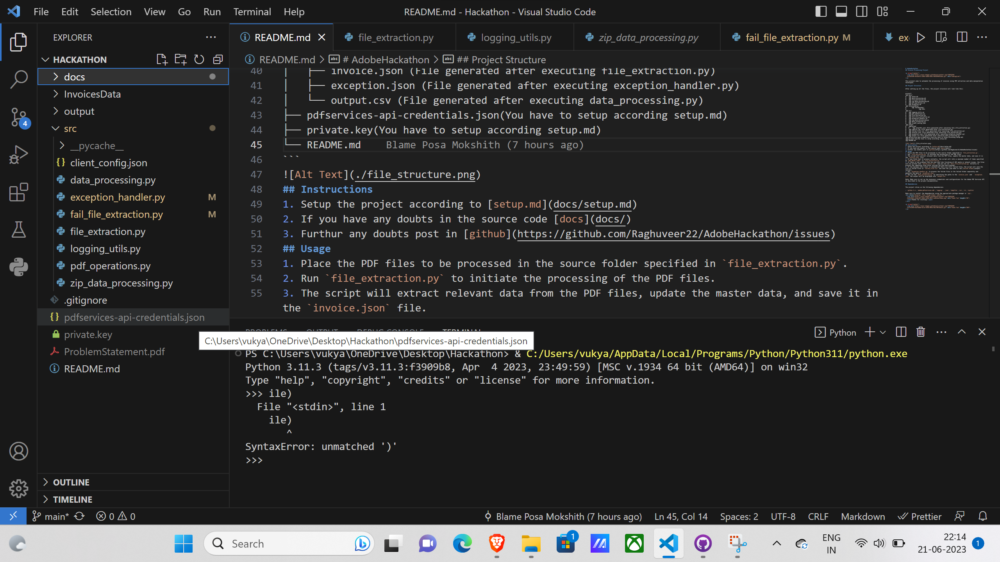

# AdobeHackathon
## Invoice Processing Project

<p align="center">
  
</p>

This project aims to automate the processing of invoices using PDF extraction and data manipulation techniques.

## Project Structure

After setting up all the files, the project structure will look like this:

```
project/
├── docs/
│   ├── setup.md
│   ├── data_processing.md
│   ├── file_extraction.md
│   ├── zip_data_processing.md
│   ├── pdf_operations.md
│   └── exception.md
├── InvoicesData/
│       └── TestDataSet/
│                └── Pdfs
├── src/
│   ├── logging_utils.py
│   ├── pdf_operations.py
│   ├── file_extraction.py
│   ├── fail_file_extraction.py
│   ├── exception_handler.py
│   ├── zip_data_processing.py
│   ├── data_processing.py
│   └── client_config.json
├── output
│   ├──failed/
│   │    └── output81.json (File generated after executing fail_file_extraction.py)
│   ├── LogFile.log (File generated after file_extraction.py)
│   ├── failed_files.txt (File generated after executing file_extraction.py)
│   ├── invoice.json (File generated after executing file_extraction.py)
│   ├── exception.json (File generated after executing exception_handler.py)
│   └── output.csv (File generated after executing data_processing.py)
├── pdfservices-api-credentials.json(You have to setup according setup.md)
├── private.key(You have to setup according setup.md)
└── README.md
```

## Instructions
1. Setup the project according to [setup.md](docs/setup.md)
2. If you have any doubts in the source code [docs](docs/)
3. Furthur any doubts post in [github](https://github.com/Raghuveer22/AdobeHackathon/issues)
## Usage
1. Place the PDF files to be processed in the source folder specified in `file_extraction.py`.
2. Run `file_extraction.py` to initiate the processing of the PDF files.
3. The script will extract relevant data from the PDF files, update the master data, and save it in the `invoice.json` file.
4. If any files fail to process initially, the script will retry a maximum number of times specified by `MAX_RETRY_LIMIT` in `file_extraction.py`.
5. If there is any problem from the user-end like finishing of API quota or network issues, the files will be written into `failed_files.txt`, and you can run `fail_file_extraction.py` directly to process the remaining files after solving the user-end problems.
6. If the maximum retry limit is reached and there are still failed files, the script will save the list of failed files in `failed_files.txt` and save the json data in the [failed folder](output/failed/).
7. Run `exception_handler.py` to process the failed files in the failed folder separately and generate the data in `exception.json`.
8. Now run the `data_processing.py` by specifying the paths to the `invoice.json` and   `exception.json` the output will be displayed into `output.csv` in the [output folder](output/)

Note: Make sure to set up the necessary credentials and configurations for the Adobe PDF Services API as described in the project documentation.

## Dependencies

The project relies on the following dependencies:

- `python 3.x`,`adobe-pdfservices-sdk`,`logging` ,`json`,`tempfile`,`csv`,`re`,`zipfile`

Make sure to install the dependencies using the appropriate package manager or `pip`.
<div style="display: flex; align-items: center;">
  
  <span>Thanks for visiting!</span>
</div>

<p align="center">
  
</p>
